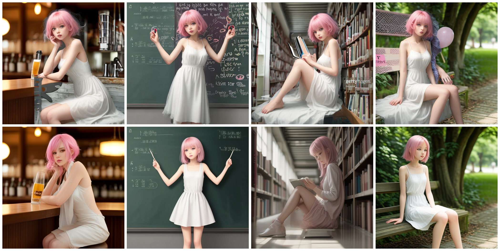
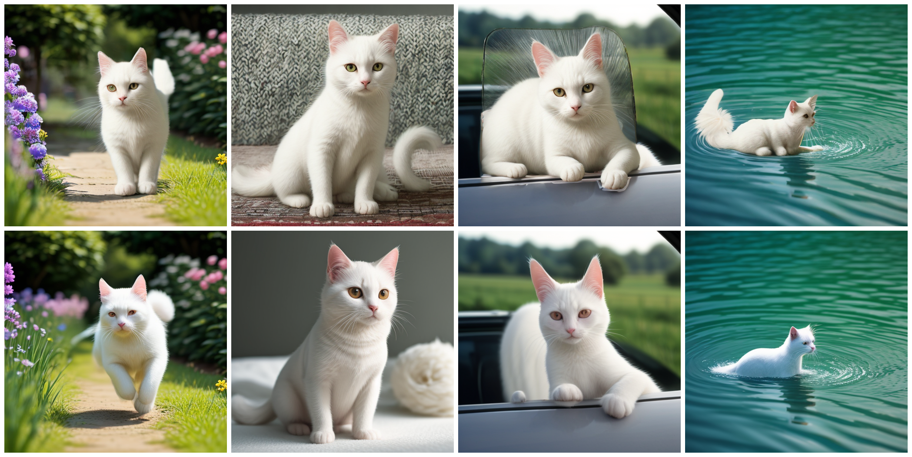

# Automated Story Illustration

A novel and training-free approach in maintaining the consistency of characters in a sequence of generated images of given story/text
The images below compare the results generated by our method (upper half) and Stable Diffusion (lower half).



(character prompt: "a thin girl with pink hair, white dress" and scene prompts: "drinking a beer in the bar", "writing numbers on a blackboard", "reading a book in library", "sitting on the bench")



(character prompt: "a white cat" and scene prompts: "running in garden", "standing on carpet", "sticking head out of the car window", "swimming in a lake")

## Installation

Clone the repo and install the dependencies.

```bash
git clone https://github.com/XinanXu010814/AutoStoryIllustration.git
cd AutoStoryIllustration
pip install -r requirements.txt
```
## Usage
```bash
python App.py
```
